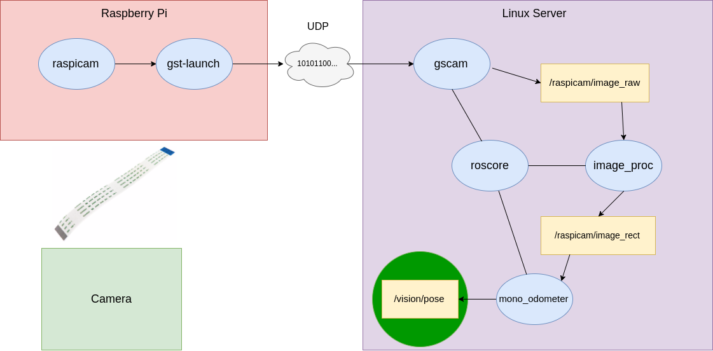

# Visual Odometry

[Reference link @ ROS Discourse](https://discourse.ros.org/t/ros-visual-odometry/2465)

----

## System architecture

So, the graph of our system looks like this:



As you can see in this picture, we have Raspberry Camera connected and raspicam creating multimedia pipeline and sending video from camera to `gst-launch`. The latter then transmit the image to our server over UDP. [gscam](https://github.com/RoboticaUtnFrba/gscam) will broadcast the video to `/raspicam/image_raw` topic. This image should be rectified with `image_proc` node. And finally, rectified image is taken by `mono_odometer`, which handles it and computes position and orientation of the robot publishing this data straight to the `/vision/pose` topic.

## Preparing the environment

Documentation about this step for the Raspicam can be found in the `ca_camera` package.

## Execute the visual odometry node

Then you can execute the visual odometry doing this:

```bash
roslaunch ca_visual_odometry vo_raspicam.launch rviz:=true
```

This will rectify the image and will use [viso2](https://github.com/RoboticaUtnFrba/viso2).
